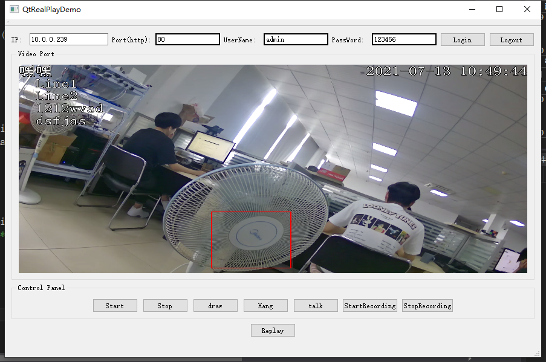

# QtRealPlayDemo

This QT5 widget uses http to extract stream data from local camera in Enzhi company to display in viewer, also can use mouse to draw squares in the viewer using draw method and send it back to camera based on i8_playSDK functions

# Features

Connects using http protocol. i8_playSDK provides communication methods and convertMP4.h(comments are in Chinese) provides methods on converting datastream to video.

